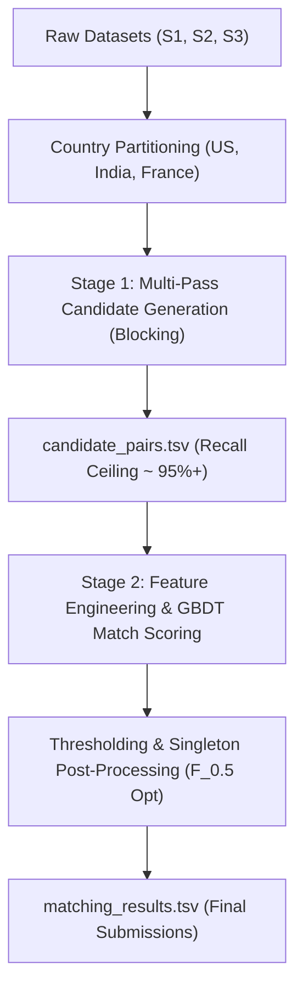

# Pipeline Architecture & Candidate Generation (Blocking)

---

## 1. High-Level Entity Resolution Architecture

Entity Resolution at scale ($1.7\text{M} \times 10\text{M} \approx 17\text{ Trillion}$ possible comparisons) requires a **two-stage architecture**:



---

## 2. Stage 1: Candidate Generation (Blocking Strategy)

The goal of blocking is to reduce the comparison space from billions of pairs down to **5–30 candidates per S1 entity**, while preserving **maximum Recall ($>95\%$)**.

### Core Blocking Passes

```
Pass 1: Exact / Normalized Name Match (within same Country)
  • Lowercase, remove legal suffixes (Inc, LLC, Pvt Ltd, Corp), strip punctuation.
  • Inverted index on cleaned name.

Pass 2: Token / N-Gram TF-IDF Cosine Similarity (MinHash LSH / Sparse Matrix)
  • Character 3-gram or token TF-IDF on normalized business_name.
  • Retrieve top-K (e.g. K=15) nearest neighbors from S2 and S3 using sparse matrix multiplication or FAISS.

Pass 3: Phonetic / Prefix Blocking
  • First 2 significant tokens of name + Soundex / Double Metaphone.
  • Matches names with heavy OCR/spelling typos (e.g. "Ihrno" vs "Iron").

Pass 4: Address Co-occurrence / Postal Code Key
  • Match by Postal Code / PIN Code + First token of name.
  • Captures cases where the name had severe noise but the location is identical.
```

---

## 3. Reduction Ratio vs. Recall Ceiling

- **Recall Ceiling ($\text{Recall}_{\text{block}}$):** The maximum possible recall achievable by the downstream classifier:
  $$\text{Recall}_{\text{block}} = \frac{|\text{True Matches in Candidate Set}|}{|\text{Total True Matches}|}$$
- **Reduction Ratio ($RR$):**
  $$RR = 1 - \frac{|\text{Candidate Pairs}|}{|S_1| \times (|S_2| + |S_3|)}$$
  *(Target $RR > 99.999\%$)*

---

## 4. Scalability & Memory Management on Kaggle

Kaggle notebooks provide **30 GB RAM** on CPU / GPU instances. Handling 12M records requires memory-efficient structures:

1. **Partition by Country:**
   - Execute pipeline independently for `US`, `India`, and `France`.
   - France (~1.7M records) runs in seconds.
   - India (~5.5M records) and US (~4.5M records) fit comfortably in RAM when processed separately.
2. **String Deduplication / Integer Indexing:**
   - Map entity IDs (`S1-xxxx`, `S2-xxxx`) to `uint32` indices during candidate generation.
   - Convert strings to sparse matrices (`scipy.sparse.csr_matrix`) for fast vectorized matrix math.
3. **Batch Generation:**
   - Query candidate retrieval in batches of 50,000 S1 entities to avoid peak RAM spikes.
4. **Intermediate Candidate Export:**
   - Save candidate pairs directly to disk in `candidate_pairs.tsv` as chunks finish.
