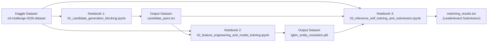

# Kaggle Dataset Creation & Multi-Notebook Setup Guide

This guide provides step-by-step instructions on **how to package and upload the dataset to Kaggle**, configure intermediate dataset outputs, and chain the 3 production notebooks.

---

## 1. How to Create the Dataset on Kaggle

The official dataset uncompressed is ~2.2 GB. Uploading it as a Kaggle Dataset makes it permanently accessible to all your notebooks with zero upload time during training.

### Step 1.1: Prepare the Files Locally
Make sure you have the unzipped dataset folder structured as follows:

```
ml_challenge_dataset/
├── train/
│   ├── train_source1.tsv
│   ├── train_source2.tsv
│   ├── train_source3.tsv
│   └── train_ground_truth.tsv
├── test/
│   ├── test_source1.tsv
│   ├── test_source2.tsv
│   └── test_source3.tsv
└── utils/
    └── validate_submission.py
```

### Step 1.2: Upload via Kaggle Web UI
1. Go to [kaggle.com/datasets](https://www.kaggle.com/datasets).
2. Click the **"+ New Dataset"** button (top right).
3. Set the Dataset Title: `ml-challenge-2026-dataset` (or `ml-challenge-2026-entity-resolution`).
4. Drag and drop the `train/`, `test/`, and `utils/` folders or upload them inside a single `.zip` file (Kaggle will automatically unzip it).
5. Click **"Create"**.

Once created, Kaggle will mount your dataset at:
```
/kaggle/input/ml-challenge-2026-dataset/
```

### Step 1.3: (Optional) Fast Upload via Kaggle CLI
If you have the Kaggle API CLI installed:
```bash
# Create metadata
kaggle datasets init -p D:/ML_Challenge/DATA/UNZIPPED/student_resource/

# Upload
kaggle datasets create -p D:/ML_Challenge/DATA/UNZIPPED/student_resource/ -u
```

---

## 2. Setting Up the 3 Chained Notebooks on Kaggle

To stay well within Kaggle's **30 GB RAM** limit and **9-hour session limit**, the pipeline is modularized into 3 notebooks that link via dataset outputs:



---

## 3. Step-by-Step Notebook Execution Workflow

### Notebook 1: Candidate Generation & Blocking
- **File:** [`notebooks/01_candidate_generation_blocking.ipynb`](file:///D:/ML_Challenge/notebooks/01_candidate_generation_blocking.ipynb)
- **Kaggle Settings:** Accelerator = `CPU` or `GPU T4 x2`, Internet = `On`.
- **Attached Input Datasets:** `ml-challenge-2026-dataset`.
- **Execution:** Click **"Run All"** / **"Save Version (Quick Save or Run All)"**.
- **Output:** Produces `candidate_pairs.tsv` in `/kaggle/working/output/`.
- **Next Step:** Under Notebook Output, click **"Create Dataset"** or make the notebook public/private to attach its output to Notebook 2 and 3.

---

### Notebook 2: Feature Engineering & LightGBM Training
- **File:** [`notebooks/02_feature_engineering_and_model_training.ipynb`](file:///D:/ML_Challenge/notebooks/02_feature_engineering_and_model_training.ipynb)
- **Kaggle Settings:** Accelerator = `CPU` or `GPU T4 x2`, Internet = `On`.
- **Attached Input Datasets:**
  1. `ml-challenge-2026-dataset`
  2. Output of Notebook 1 (containing `candidate_pairs.tsv`).
- **Execution:** Computes pairwise features, runs `StratifiedGroupKFold` CV, trains LightGBM, optimizes threshold $\tau^*$ for Macro $F_{0.5}$.
- **Output:** Produces `lgbm_entity_resolution.pkl` in `/kaggle/working/`.

---

### Notebook 3: Test Inference, Self-Training & Submission
- **File:** [`notebooks/03_inference_self_training_and_submission.ipynb`](file:///D:/ML_Challenge/notebooks/03_inference_self_training_and_submission.ipynb)
- **Kaggle Settings:** Accelerator = `CPU` or `GPU T4 x2`, Internet = `On`.
- **Attached Input Datasets:**
  1. `ml-challenge-2026-dataset`
  2. Output of Notebook 1 (`candidate_pairs.tsv`)
  3. Output of Notebook 2 (`lgbm_entity_resolution.pkl`)
- **Execution:**
  1. Computes test features.
  2. Runs **Self-Training Domain Adaptation for France** (pseudo-label bootstrap).
  3. Runs **Graph-Based Post-Processing** (Cardinality enforcement + Singleton protection).
  4. Generates `matching_results.tsv` (1,732,544 rows).
  5. Executes `validate_submission.py` to ensure 100% compliance.
- **Output:** `matching_results.tsv` ready for leaderboard upload!
